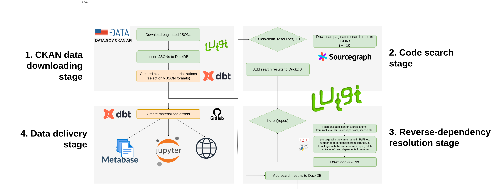

# Common data usage pipeline - docs

## Flow

## Getting started

### Before everything

* `export PYTHONPATH=$(pwd)` in repo root
* `poetry shell` to entry poetry venv
* `export CONFIG_PATH=...` set path to site config or use `--config-file` flag. Available configs in `configs/`
* Run `luigid` in another terminal when running luigi tasks to run scheduler at https://localhost:8082
* TODO: set dbt config

### Executing the pipeline

Pipeline execution is a semi-manual procedure.

**CKAN data downloading stage**

1. `./cli.sh download-datasets-info`
    * [luigi] Downloads CKAN dataset info as JSON files
2. `./cli.sh create-raw-ckan-db-tables` && `./cli.sh insert-datasets-info`
    * [luigi] Creates `ckan_api.db` DuckDB file from downloaded JSONs
    * Copies newly created db file to `artifacts/read_only/{site_short_name}/ckan_api_{datetime}.db`
3. Copy manually the DuckDB readonly file to `artifacts/dbt/input/ckan_api.db`
4. Run `dbt run --select "models/ckan_clean"` in `dbt/open_data_usage_dbt` using dir's poetry venv
    * Creates new clean `artifacts/dbt/output/clean_ckan_api.db`
5. Copy that file to `artifacts/read_only/{site_short_name}/clean_ckan_api_{datetime}.db`

**Code search stage**

6. `./cli.sh download-sourcegraph-results`
    * [luigi] Downloads SourceGraph search results as JSON files based on `artifacts/dbt/output/clean_ckan_api.db`
7. `./cli.sh insert-sourcegraph-results`
    * [luigi] Creates `sourcegraph_api.db` DuckDB file from downloaded JSONs
    * Copies newly created db file to `artifacts/read_only/{site_short_name}/sourcegraph_api_{datetime}.db`
8. TODO: docs

## Artifacts

* Artifacts dir should be backed up to the blob bucket (repo uses Google Storage).
* It is advised to back up the artifacts dir after you completed a chunk of work using `./sync_artifacts.sh`
* You can create a bucket using `./create_gcp_bucket.sh` script. It's recommended that bucket has soft delete period set to at least 2 weeks.
* `GCP_PROJECT` and `GCP_BUCKET` env vars have to be set (either via shell or `.env` file)

## Troubleshooting

* Sometimes there is need to run luigi tasks which download data from the Internet multiple times cause they fail bc of
  network conditions
* There can be pickle read errors. It's best to delete JSONs which are the base for pickle file and run single tasks
  manually

## Caveats

* dbt files are stored as a separate project due to the deps conflict
  * https://github.com/dbt-labs/dbt-semantic-interfaces/issues/134

